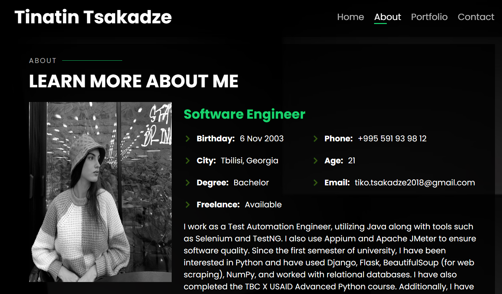

# My Portfolio

## Table of Contents
- [Prerequisites](#prerequisites)
- [Tech Stack](#tech-stack)
- [Screenshot](#screenshot)
- [Getting Started](#getting-started)
- [Project Structure](#project-structure)
- [Deployment](#deployment)
- [Author](#author)

## Prerequisites
Make sure you have the following installed before running the project:
- **npm** @8 and up
- **TypeScript** @5.0.4

## Tech Stack
This project is built using:
- **ReactJS** @18.1.0 - Frontend framework  
- **Styled-components** @5.3.9 - Styling with component-based approach  
- **Next.js** @13.4 - React framework for server-side rendering and static site generation  

## Screenshot


## Getting Started
Follow these steps to set up the project locally:

### 1. Clone the Repository
```sh
git clone https://github.com/TikoTs/react_final.git
cd react_final
```

### 2. Install Dependencies
```sh
npm install
```

### 3. Start the Development Server
```sh
npm run dev
```
Now, open your browser and go to `http://localhost:3000` to see the project in action.

## Project Structure
```
react_final/
│── public/          # Static assets
│── src/             # Source code
│   ├── components/  # Reusable components
│   ├── pages/       # Next.js pages
│   ├── styles/      # Global styles
│── .gitignore       # Git ignore file
│── package.json     # Project dependencies
│── README.md        # Project documentation
```

## Deployment
This project can be deployed using **Vercel** or any other hosting service supporting Next.js.

To deploy on Vercel, run:
```sh
vercel
```

## Author
Developed by **Tinatin Tsakadze**  
For any questions, feel free to reach out!

---
